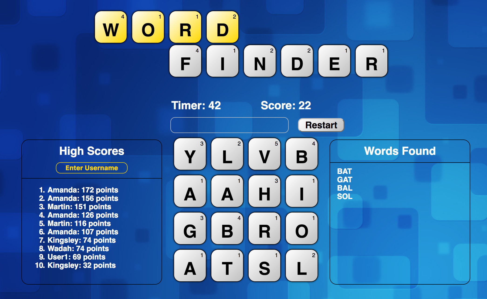
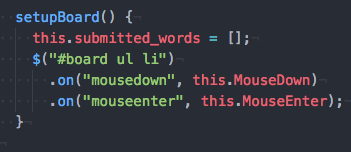
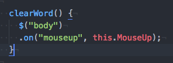
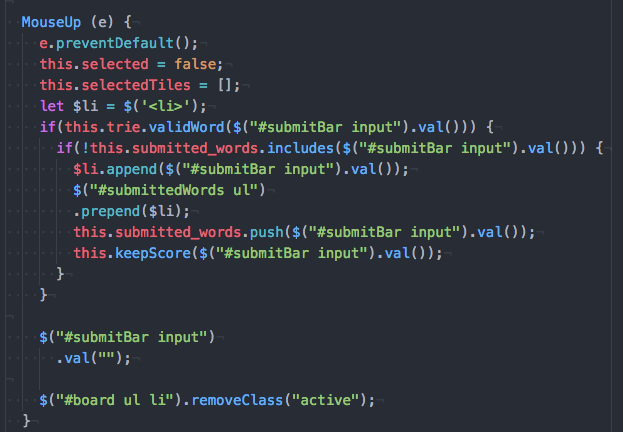
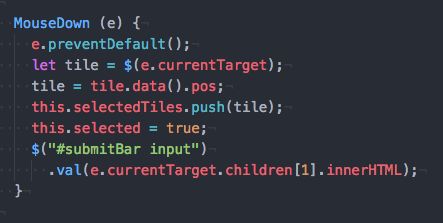
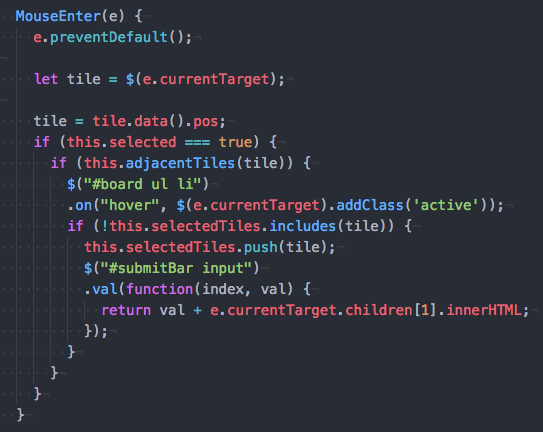
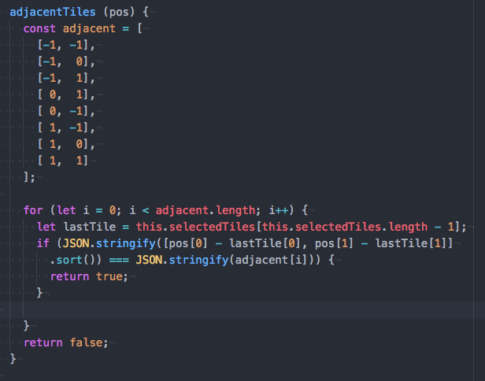
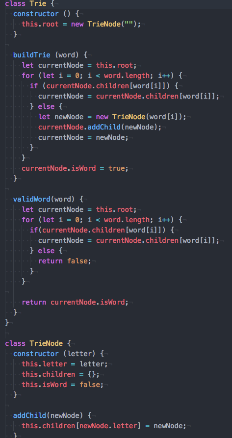
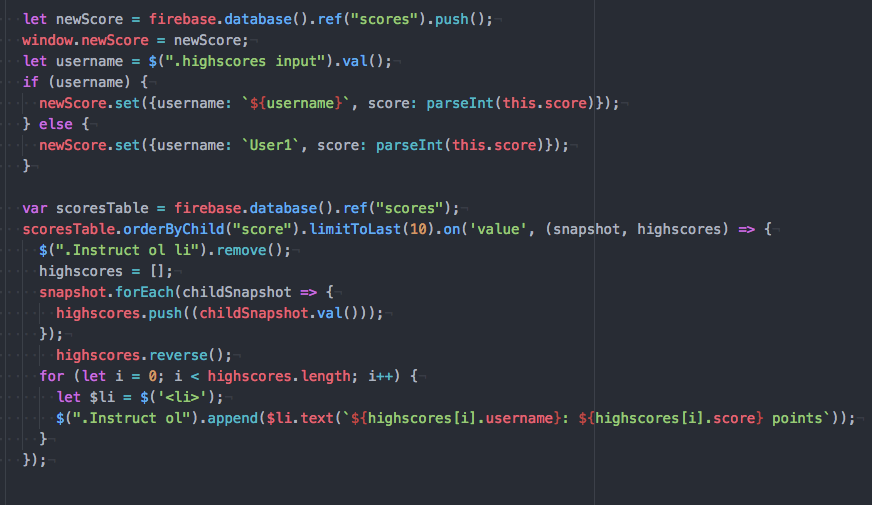

# Word Finder

Demo the game [here][word-finder]!

[word-finder]: https://mwchung24.github.io/Word-Finder/

Word Finder is a boggle like game that was inspired by Scramble With Friends (otherwise known as Word Streak).  The game was built using JavaScript and jQuery.

## How to Play

The goal of the game is for the user to the find as many words as they can in 60 seconds.  A user can enter their name under the "High Scores" header in order to keep track of their scores.  When the start button is clicked, a 4x4 board of letters will appear.  A restart button will then replace the start button that will allow the user restart and randomize the board.  The user can click and drag across adjacent tiles to create words (users can drag diagonally).  The word will then be compared with a dictionary and will only be submitted into the Words Found section if the word is found in the dictionary.  Once a word is submitted into the Words Found section, the score will be updated.  The high scores section will only render the top 10 highest scores.  If the user's score is high enough to break the top 10 scores, then the high scores will be updated with the user's username and score in real time.

## Implementation

### Creating Words
The ability for the user to be able to click and drag to create words was implemented using jQuery and mouse events.

### Dictionary Lookup

### High scores

## Future Improvements

### Path between tiles
As users click and drag across the tiles, a path should render between the tiles.

### Double/Triple Letter
2-3 words would randomly be assigned a double or triple letter "power up".

### Power Up Items
Similar to Scramble with Friends, give user a choice to pick between 4 power ups.
1. Freeze: Stop the timer for 15 seconds.
2. Inspiration: Highlights a word a user has not found.
3. Spin: Rotates the board to provide different perspective.
4. Vision: Shows 3 words that have not been found in a modal.
